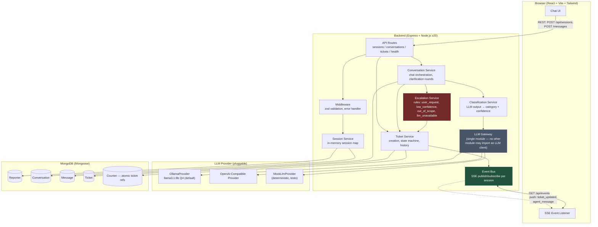
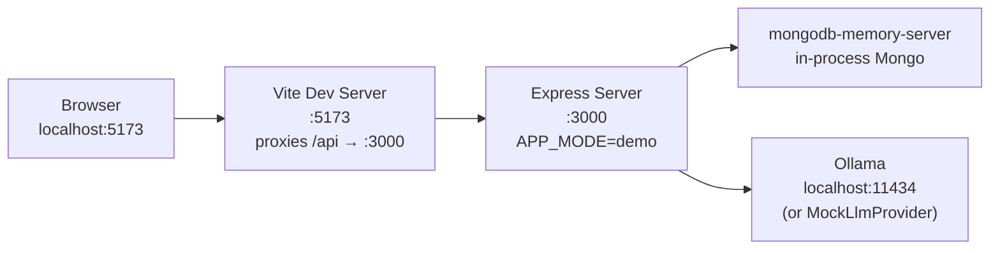

# Architecture: Conversational & Ticketing Foundation

## System Overview

## Key Architectural Principles

1. **Single LLM Gateway** (Principle VI): All LLM access is funneled through `backend/src/services/llm/` — no other module imports an LLM client directly. This makes provider swaps (Ollama ↔ OpenAI-compatible ↔ Mock) a one-line config change and keeps LLM output validation centralized.

2. **Zero Execution Capability** (Principle II — Safety-First): There is no executor, no command whitelist, no code path that runs anything. The chatbot classifies and creates tickets; it never acts on the user's machine. LLM responses are treated as untrusted input — zod-validated against a closed category enum before use.

3. **Escalation as First-Class Citizen** (Principle III — Human-in-the-Loop): The Escalation Service is a dedicated module, unit-tested independently (TDD, tests-first per Principle IV) from the conversation flow. Every escalation path (explicit request, low confidence, out-of-scope, LLM unavailable) converges on the same `human_involved` handling-mode transition and carries the full conversation transcript.

4. **Event-Driven Real-Time Updates**: The Event Bus is an in-process pub/sub keyed by session ID. Ticket state transitions and new agent messages publish events that SSE clients subscribe to, satisfying the ≤2-second update SLA (SC-004) without polling.

5. **Session/Reporter Separation**: Sessions are ephemeral (in-memory, per browser tab); Reporters are persistent (MongoDB, keyed by `orgId`). This lets a reporter resume across sessions/devices and see all previously reported open tickets (FR-008).

## Deployment Topology (Demo Environment)

All four components run on a single machine (HP Victus 16) for the demo path — no cloud dependency on the core flow.
