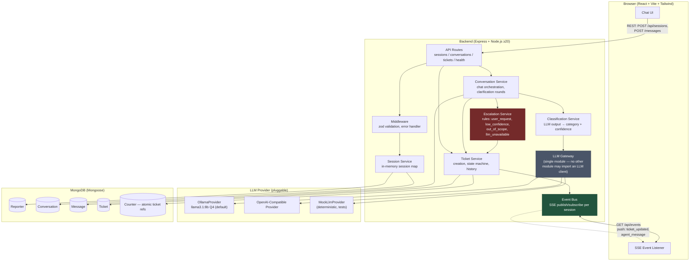
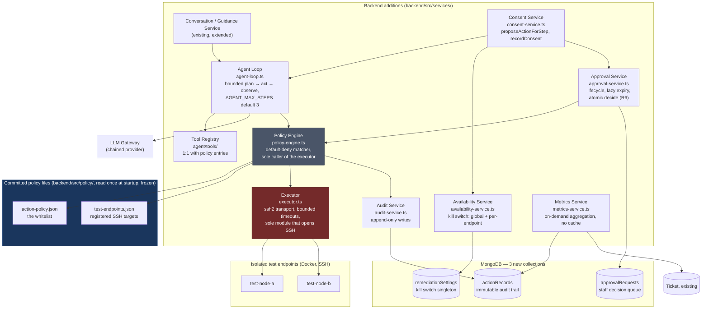
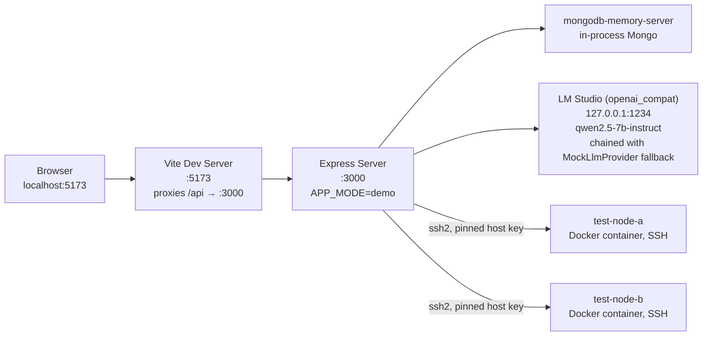

# Architecture: Conversational & Ticketing Foundation

## System Overview

```mermaid
graph TB
    subgraph Client["Browser (React + Vite + Tailwind)"]
        UI[Chat UI]
        SSEClient[SSE Event Listener]
    end

    subgraph Backend["Backend (Express + Node.js ≥20)"]
        Routes["API Routes<br/>sessions / conversations / tickets / health"]
        Middleware["Middleware<br/>zod validation, error handler"]
        SessionSvc["Session Service<br/>in-memory session map"]
        ConvSvc["Conversation Service<br/>chat orchestration, clarification rounds"]
        ClassifySvc["Classification Service<br/>LLM output → category + confidence"]
        EscalationSvc["Escalation Service<br/>rules: user_request, low_confidence,<br/>out_of_scope, llm_unavailable"]
        TicketSvc["Ticket Service<br/>creation, state machine, history"]
        EventBus["Event Bus<br/>SSE publish/subscribe per session"]
        LLMGateway["LLM Gateway<br/>(single module — no other<br/>module may import an LLM client)"]
    end

    subgraph LLM["LLM Provider (pluggable)"]
        Ollama["OllamaProvider<br/>llama3.1:8b Q4 (default)"]
        OpenAICompat["OpenAI-Compatible Provider"]
        Mock["MockLlmProvider<br/>(deterministic, tests)"]
    end

    subgraph DB["MongoDB (Mongoose)"]
        Reporter[(Reporter)]
        Conversation[(Conversation)]
        Message[(Message)]
        Ticket[(Ticket)]
        Counter[(Counter — atomic ticket refs)]
    end

    UI -->|REST: POST /api/sessions,<br/>POST /messages| Routes
    SSEClient <-->|GET /api/events<br/>SSE stream| EventBus

    Routes --> Middleware --> SessionSvc
    Routes --> ConvSvc
    Routes --> TicketSvc

    ConvSvc --> ClassifySvc
    ConvSvc --> EscalationSvc
    ClassifySvc --> LLMGateway
    LLMGateway --> Ollama
    LLMGateway --> OpenAICompat
    LLMGateway --> Mock

    ConvSvc --> TicketSvc
    EscalationSvc --> TicketSvc
    TicketSvc --> EventBus
    EventBus -.->|push: ticket_updated,<br/>agent_message| SSEClient

    SessionSvc --> Reporter
    SessionSvc --> Conversation
    ConvSvc --> Message
    TicketSvc --> Ticket
    TicketSvc --> Counter

    style LLMGateway fill:#4a5568,stroke:#2d3748,color:#fff
    style EscalationSvc fill:#742a2a,stroke:#521717,color:#fff
    style EventBus fill:#22543d,stroke:#1a4331,color:#fff
```

## Key Architectural Principles

1. **Single LLM Gateway** (Principle VI): All LLM access is funneled through `backend/src/services/llm/` — no other module imports an LLM client directly. This makes provider swaps (Ollama ↔ OpenAI-compatible ↔ Mock) a one-line config change and keeps LLM output validation centralized.

2. **Zero Execution Capability** (Principle II — Safety-First): There is no executor, no command whitelist, no code path that runs anything. The chatbot classifies and creates tickets; it never acts on the user's machine. LLM responses are treated as untrusted input — zod-validated against a closed category enum before use.

3. **Escalation as First-Class Citizen** (Principle III — Human-in-the-Loop): The Escalation Service is a dedicated module, unit-tested independently (TDD, tests-first per Principle IV) from the conversation flow. Every escalation path (explicit request, low confidence, out-of-scope, LLM unavailable) converges on the same `human_involved` handling-mode transition and carries the full conversation transcript.

4. **Event-Driven Real-Time Updates**: The Event Bus is an in-process pub/sub keyed by session ID. Ticket state transitions and new agent messages publish events that SSE clients subscribe to, satisfying the ≤2-second update SLA (SC-004) without polling.

5. **Session/Reporter Separation**: Sessions are ephemeral (in-memory, per browser tab); Reporters are persistent (MongoDB, keyed by `orgId`). This lets a reporter resume across sessions/devices and see all previously reported open tickets (FR-008).

6. **LLM Gateway is now a fallback chain** (CD-1, 005-constrained-remediation): the default
   provider is `ChainedLlmProvider`, trying `LLM_PROVIDERS` in order (typically
   `openai_compat` against a local LM Studio instance, falling back to `MockLlmProvider`).
   Fallback is `warn`-logged and counted in `providerFallbacks` on the metrics summary — it is
   deliberately **not** written to the action audit trail, so that trail keeps its exact
   "every executed and refused action, nothing else" property (SC-002). The gateway boundary
   itself is unchanged: still the one module every other module goes through.

7. **Constrained Automated Remediation** (005-constrained-remediation): a policy-gated,
   whitelist-only action subsystem hangs off the guidance flow — see
   [Constrained Automated Remediation Subsystem](#constrained-automated-remediation-subsystem-005-constrained-remediation)
   below for its own diagram, module boundaries, and principles.

## Constrained Automated Remediation Subsystem (005-constrained-remediation)

The remediation subsystem is additive: it hangs off the existing guided-troubleshooting flow
at the points where an approved action may apply, and never replaces the deterministic
classification/guidance pipeline above. Its own module boundary matters more than the system
diagram's — the policy engine is the **sole** caller of the executor, and the executor is the
**sole** module that opens an SSH connection.

```mermaid
graph TB
    subgraph Backend["Backend additions (backend/src/services/)"]
        ConvSvc2["Conversation / Guidance Service<br/>(existing, extended)"]
        Loop["Agent Loop<br/>agent-loop.ts<br/>bounded plan → act → observe,<br/>AGENT_MAX_STEPS default 3"]
        Tools["Tool Registry<br/>agent/tools/<br/>1:1 with policy entries"]
        ConsentSvc["Consent Service<br/>consent-service.ts<br/>proposeActionForStep, recordConsent"]
        PolicyEngine["Policy Engine<br/>policy-engine.ts<br/>default-deny matcher,<br/>sole caller of the executor"]
        Executor["Executor<br/>executor.ts<br/>ssh2 transport, bounded timeouts,<br/>sole module that opens SSH"]
        ApprovalSvc["Approval Service<br/>approval-service.ts<br/>lifecycle, lazy expiry,<br/>atomic decide (R6)"]
        AvailSvc["Availability Service<br/>availability-service.ts<br/>kill switch: global + per-endpoint"]
        AuditSvc["Audit Service<br/>audit-service.ts<br/>append-only writes"]
        MetricsSvc["Metrics Service<br/>metrics-service.ts<br/>on-demand aggregation, no cache"]
    end

    subgraph PolicyStore["Committed policy files (backend/src/policy/, read once at startup, frozen)"]
        ActionPolicy["action-policy.json<br/>the whitelist"]
        EndpointRegistry["test-endpoints.json<br/>registered SSH targets"]
    end

    subgraph RemediationDB["MongoDB — 3 new collections"]
        RemSettings[(remediationSettings<br/>kill switch singleton)]
        ApprovalReqs[(approvalRequests<br/>staff decision queue)]
        ActionRecs[(actionRecords<br/>immutable audit trail)]
    end

    subgraph TestEndpoints["Isolated test endpoints (Docker, SSH)"]
        NodeA["test-node-a"]
        NodeB["test-node-b"]
    end

    ConvSvc2 --> Loop
    Loop --> Tools
    Loop --> LLMGateway2["LLM Gateway<br/>(chained provider)"]
    Loop --> PolicyEngine
    ConsentSvc --> Loop
    ConsentSvc --> AvailSvc
    ConsentSvc --> ApprovalSvc
    ApprovalSvc --> PolicyEngine
    PolicyEngine --> ActionPolicy
    PolicyEngine --> EndpointRegistry
    PolicyEngine --> Executor
    Executor --> NodeA
    Executor --> NodeB
    PolicyEngine --> AuditSvc
    AvailSvc --> RemSettings
    ApprovalSvc --> ApprovalReqs
    AuditSvc --> ActionRecs
    MetricsSvc --> ActionRecs
    MetricsSvc --> Ticket2[(Ticket, existing)]

    style PolicyEngine fill:#4a5568,stroke:#2d3748,color:#fff
    style Executor fill:#742a2a,stroke:#521717,color:#fff
    style PolicyStore fill:#1a365d,stroke:#153e75,color:#fff
```

**Key architectural principles specific to this subsystem**:

1. **Policy is a file, not a document** (data-model.md, Principle II): `action-policy.json`
   and `test-endpoints.json` are read once at startup, zod-validated, and frozen. No write
   path exists anywhere in the codebase — the running system cannot expand its own whitelist.

2. **Two-tier authorisation** (FR-004): `read_only` actions need reporter consent alone;
   `state_changing` actions need reporter consent **and** a staff approval decision. The tier
   comes from the matched policy entry, never from agent judgement.

3. **The agent loop is scoped, not global** (R5): `runAgentLoop` only runs at the points in
   the guided flow where an approved action may apply — it does not replace the shipped
   classification/guidance pipeline, and it cannot reorder or skip guided steps (FR-014).
   Bounds: `AGENT_MAX_STEPS` per employee turn (default 3), plus no-progress detection
   (same `(tool, arguments)` proposed twice, or two consecutive empty proposals) — both
   escalate rather than loop (FR-012).

4. **Default-deny matching is exact** (FR-002, US2 AS3): `matchAction` requires the policy
   entry id, every argument, and the target endpoint to match exactly. There is no fuzzy,
   prefix, or nearest-neighbour match anywhere in the path.

5. **The policy engine is the sole executor caller**: nothing else in the codebase invokes
   `executeViaSsh`. This makes the executor boundary auditable by import graph alone.

6. **Verification, not blind trust** (R10): a `state_changing` entry's `verifiedBy` names a
   `read_only` entry whose output is judged (`judgeVerification`) before the outcome is
   recorded — `succeeded` is never assumed from a zero exit code alone.

7. **Refusals are audited, not silent** (FR-009/FR-010): every refusal — no matching entry,
   argument mismatch, unregistered target, missing consent/approval, disabled kill switch,
   degraded model, and more — produces an `ActionRecord` with `outcome: "refused"`, on the
   same immutable trail as every executed action.

## Deployment Topology (Demo Environment)

```mermaid
graph LR
    Browser["Browser<br/>localhost:5173"]
    Vite["Vite Dev Server<br/>:5173<br/>proxies /api → :3000"]
    Express["Express Server<br/>:3000<br/>APP_MODE=demo"]
    MongoMem["mongodb-memory-server<br/>in-process Mongo"]
    LmStudio["LM Studio (openai_compat)<br/>127.0.0.1:1234<br/>qwen2.5-7b-instruct<br/>chained with MockLlmProvider fallback"]
    NodeA["test-node-a<br/>Docker container, SSH"]
    NodeB["test-node-b<br/>Docker container, SSH"]

    Browser --> Vite
    Vite --> Express
    Express --> MongoMem
    Express --> LmStudio
    Express -->|ssh2, pinned host key| NodeA
    Express -->|ssh2, pinned host key| NodeB
```

All components run on a single machine (HP Victus 16) for the demo path — no cloud dependency
on the core flow. `test-node-a` and `test-node-b` are isolated, resettable Docker containers
distinct from the demo machine itself (NFR-3): remediation actions never reach the host that
runs the application.
