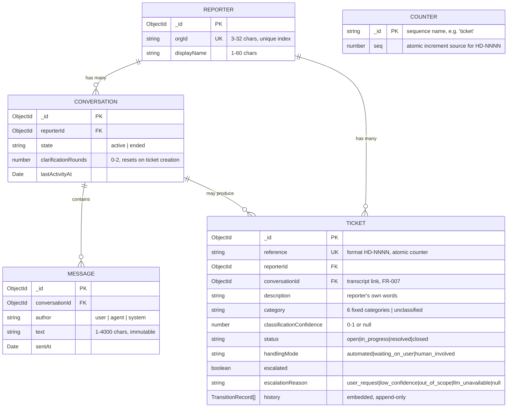

# Entity-Relationship Diagram: Conversational & Ticketing Foundation

## ERD

## Embedded Subdocument: TransitionRecord

Not a separate collection — embedded within `Ticket.history[]`, append-only (no update/delete path):

| Field | Type | Notes |
|---|---|---|
| `at` | Date | timestamp of transition |
| `field` | `"status"` \| `"handlingMode"` | which axis changed |
| `from` | string | prior value |
| `to` | string | new value |
| `actor` | `"agent"` \| `"user"` \| `"system"` \| `"staff"` | who triggered it |

## Enumerations Reference

| Enum | Values |
|---|---|
| `IssueCategory` | `password_login`, `network`, `printer`, `peripherals`, `performance`, `service_status`, `unclassified` |
| `TicketStatus` | `open`, `in_progress`, `resolved`, `closed` |
| `HandlingMode` | `automated`, `waiting_on_user`, `human_involved` |
| `MessageAuthor` | `user`, `agent`, `system` |
| `Actor` | `agent`, `user`, `system`, `staff` |
| `EscalationReason` | `user_request`, `low_confidence`, `out_of_scope`, `llm_unavailable` |

## Cardinality Notes

- **Reporter → Conversation**: one-to-many. A reporter accumulates a new Conversation each session start (or resumes an existing active one).
- **Reporter → Ticket**: one-to-many, denormalized FK (also reachable via Conversation) to support fast "all my tickets" queries (TC-026) without a join.
- **Conversation → Message**: one-to-many, unbounded growth — kept in a separate collection rather than embedded.
- **Conversation → Ticket**: one-to-many. A single conversation can produce multiple tickets (e.g., duplicate-denied reports open a second ticket per TC-054; two-problems-in-one-message handled sequentially per TC-051).
- **Counter**: singleton-per-sequence collection used only for atomic `HD-NNNN` reference generation — not part of the domain model proper.
