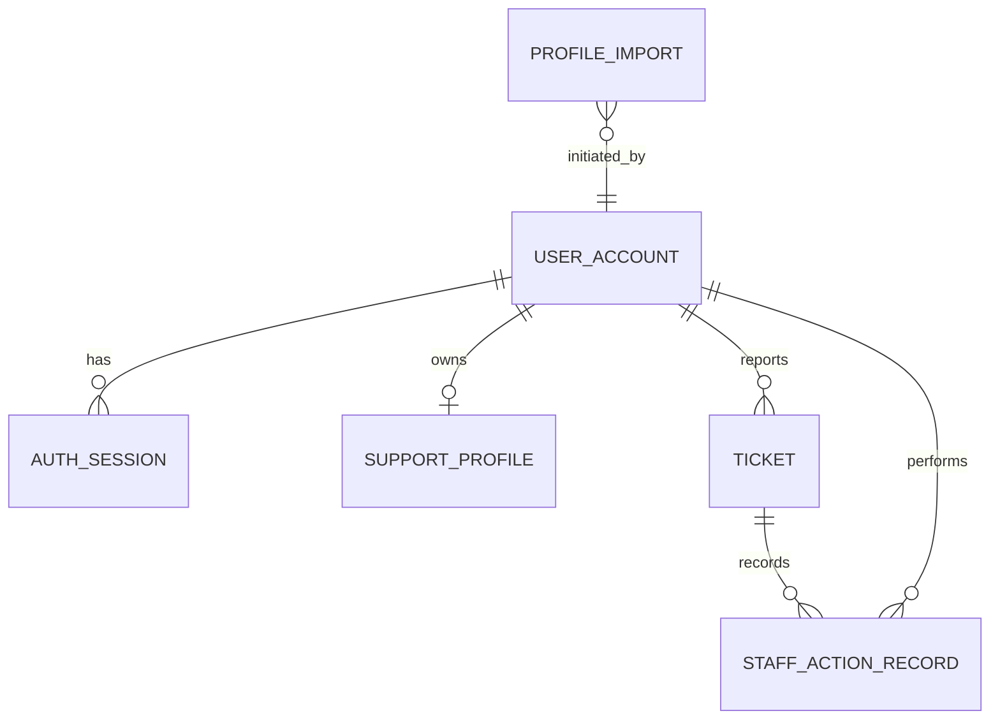

# Feature 004 role and data design

The application has exactly two HTTP roles: regular users own their tickets/profile, while staff can operate the dashboard, append profile entries, manage credentials, and import users. Maintainer seed actions are outside the application role model.
