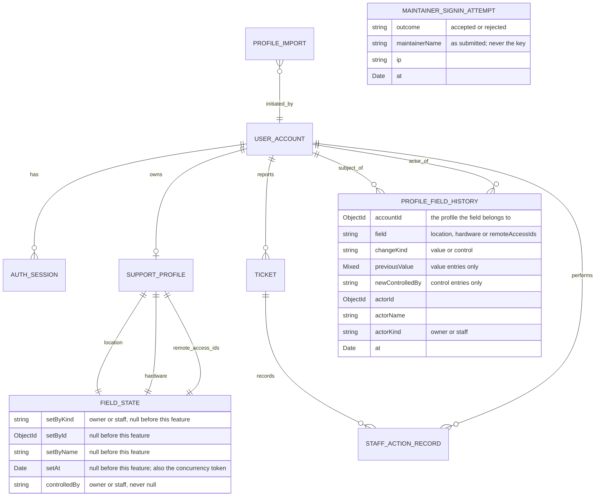

# Feature 004 role and data design

```mermaid
erDiagram
  USER_ACCOUNT ||--o{ AUTH_SESSION : has
  USER_ACCOUNT ||--o| SUPPORT_PROFILE : owns
  USER_ACCOUNT ||--o{ TICKET : reports
  TICKET ||--o{ STAFF_ACTION_RECORD : records
  USER_ACCOUNT ||--o{ STAFF_ACTION_RECORD : performs
  PROFILE_IMPORT }o--|| USER_ACCOUNT : initiated_by
  SUPPORT_PROFILE ||--|| FIELD_STATE : location
  SUPPORT_PROFILE ||--|| FIELD_STATE : hardware
  SUPPORT_PROFILE ||--|| FIELD_STATE : remote_access_ids
  USER_ACCOUNT ||--o{ PROFILE_FIELD_HISTORY : subject_of
  USER_ACCOUNT ||--o{ PROFILE_FIELD_HISTORY : actor_of

  FIELD_STATE {
    string setByKind "owner or staff, null before this feature"
    ObjectId setById "null before this feature"
    string setByName "null before this feature"
    Date setAt "null before this feature; also the concurrency token"
    string controlledBy "owner or staff, never null"
  }

  PROFILE_FIELD_HISTORY {
    ObjectId accountId "the profile the field belongs to"
    string field "location, hardware or remoteAccessIds"
    string changeKind "value or control"
    Mixed previousValue "value entries only"
    string newControlledBy "control entries only"
    ObjectId actorId
    string actorName
    string actorKind "owner or staff"
    Date at
  }

  MAINTAINER_SIGNIN_ATTEMPT {
    string outcome "accepted or rejected"
    string maintainerName "as submitted; never the key"
    string ip
    Date at
  }
```

The application has exactly two HTTP roles: regular users own their tickets/profile, while
staff can operate the dashboard, append profile entries, manage credentials, and import users.
Maintainer seed actions are outside the application role model.

## Feature 007 additions

**`FIELD_STATE` is a sub-document, not a collection.** It is embedded three times in
`SUPPORT_PROFILE` under named keys (`location`, `hardware`, `remoteAccessIds`) rather than as a
map, so a fourth profile field cannot be introduced by writing one (FR-028). Its `setAt` does
double duty: it is both the provenance timestamp shown to the reader and the concurrency token
a save must present, which is why a save that omits it is refused rather than allowed to
overwrite blindly.

`controlledBy` is the only member that is never null. A field with no recorded staff claim is
owner-controlled by definition, not by absence, whereas a value set before this feature has no
recorded author and says so. The two are different facts and the schema keeps them different.

**`PROFILE_FIELD_HISTORY` is append-only, in every role.** There is no update path and no delete
path — not for staff, not for the account owner, not for the maintainer, who has no route into
`/api/staff/*` at all. `USER_ACCOUNT` appears twice against it because the person a change was
made to and the person who made it are different accounts in the case the collection exists
for. A staff write that also takes control of a field appends one `value` entry and one
`control` entry rather than one combined entry, so "the value changed" and "who may edit it
changed" are never conflated in the record.

**`MAINTAINER_SIGNIN_ATTEMPT` stands alone, with no relationship to `USER_ACCOUNT`.** The
maintainer is a shared secret carried in a header, not an account, so there is no foreign key to
draw and drawing one would imply the third role the constitution forbids (Principle III). It is
append-only for the same reason as the history above, and it records the submitted maintainer
*name* and never the submitted key (FR-035).
