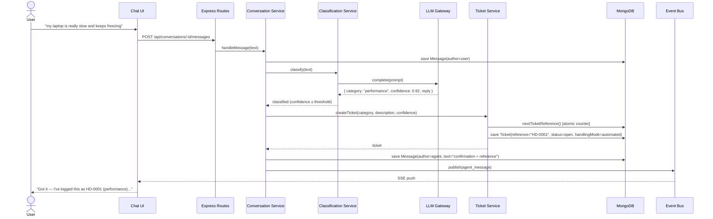
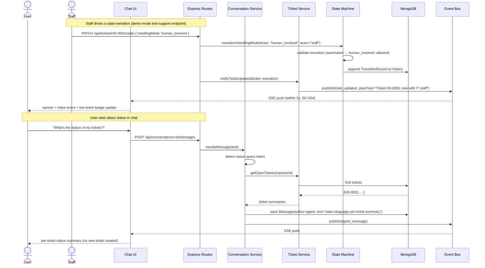
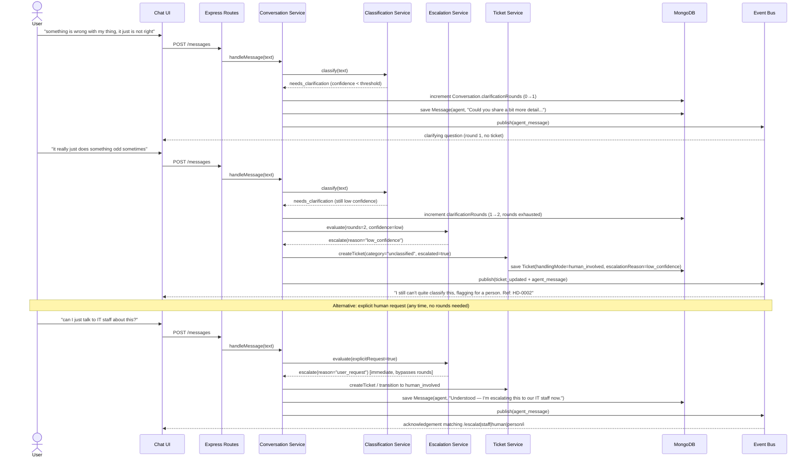
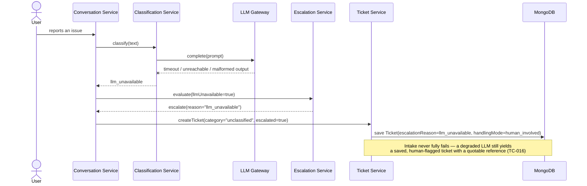

# Sequence Diagrams: Conversational & Ticketing Foundation

## 1. Report an Issue → Classified Ticket (US1)

## 2. Status Query + Live Staff-Driven Update (US2)

## 3. Clarification → Escalation Flow (US3)

## 4. LLM Degradation Path

