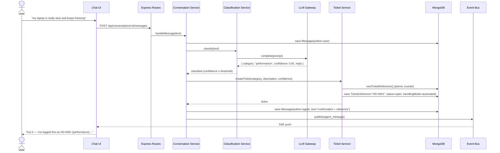
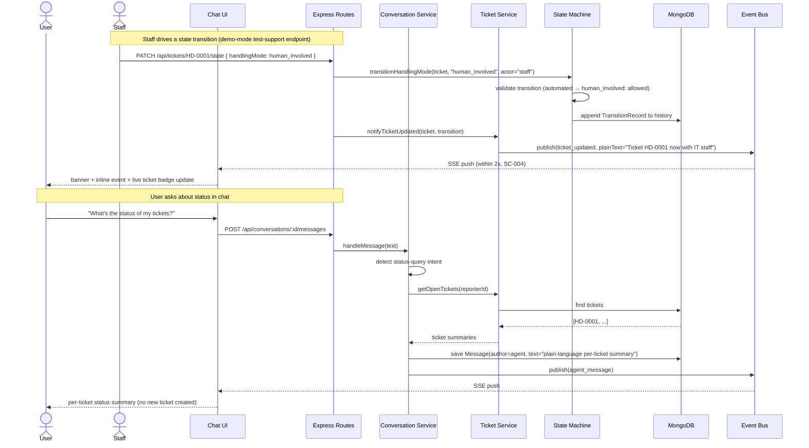
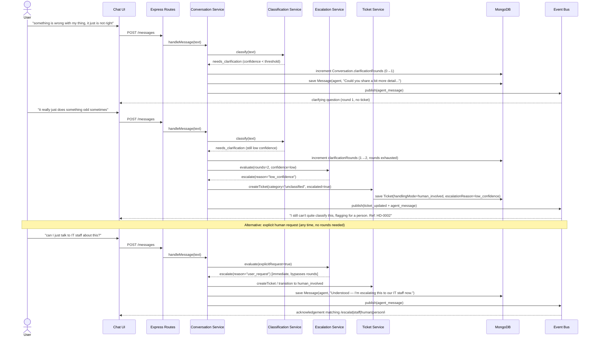
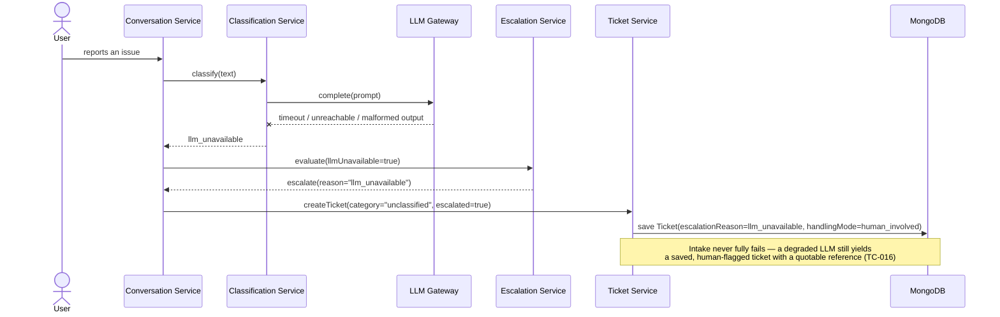
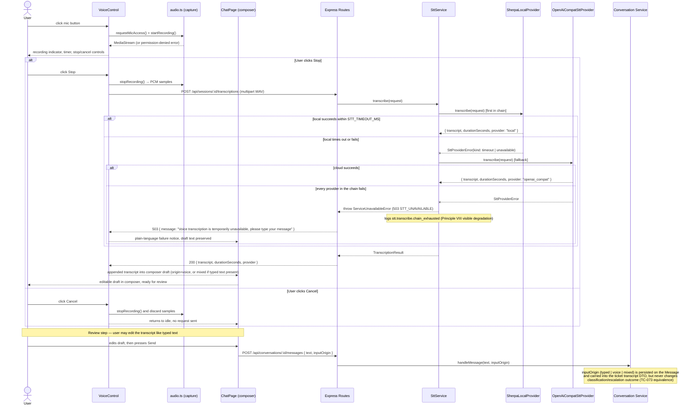

# Sequence Diagrams: Conversational & Ticketing Foundation

## 1. Report an Issue → Classified Ticket (US1)



## 2. Status Query + Live Staff-Driven Update (US2)



## 3. Clarification → Escalation Flow (US3)



## 4. LLM Degradation Path



## 5. Voice Input: Record → Transcribe → Review → Send



## 4. Guided Troubleshooting — Classified Ticket → Step-by-Step Resolution or Escalation (003-guided-troubleshooting)

```mermaid
sequenceDiagram
    actor User
    participant UI as Chat UI
    participant API as Express Routes
    participant Conv as Conversation Service
    participant Guidance as Guidance Service
    participant LLM as LLM Gateway
    participant DB as MongoDB
    participant SSE as Event Bus

    User->>UI: "I forgot my password and can't log into my computer"
    UI->>API: POST /api/conversations/:id/messages
    API->>Conv: processReply(text)
    Conv->>Conv: classify(text) → { category: "password_login", confidence: 0.9 }
    Conv->>DB: createTicket(category, description, handlingMode=automated)
    Conv->>SSE: publish(ticket_created)
    Conv->>Guidance: startGuidedSession(conversationId, ticketId, categoryName)
    Guidance->>DB: findActiveGuide(categoryName)
    alt active guide exists (FR-012 guard passes)
        Guidance->>DB: create GuidedSession(state=active, guideVersion=<pinned>, currentStepIndex=0)
        Guidance-->>Conv: { session, guide }
        Conv->>DB: save Message(author=agent, text="ticket ref + Step 1 of N: <instruction>", guidance={stepIndex:0, stepCount:N})
        Conv->>SSE: publish(agent_message)
        SSE-->>UI: SSE push
        UI-->>User: confirmation + Step 1 of N, with QuickReplies chips

        loop while session is active
            User->>UI: "didn't work" / "already tried" / "that worked" / question / "talk to a human"
            UI->>API: POST /api/conversations/:id/messages
            API->>Conv: processReply(text)
            Conv->>Guidance: interpretReply(history, text, currentStep)
            Guidance->>LLM: interpretStepReply(stepInstruction, successHint, text)
            LLM-->>Guidance: { outcome, confidence, reply } [strict JSON, zod-validated]
            Note over Guidance: confidence < CONFIDENCE_THRESHOLD → downgraded to "unclear" (FR-013)<br/>the LLM only classifies the reply; decideStepTransition (pure, no I/O) decides what happens next
            Guidance->>Guidance: decideStepTransition(outcome, currentStepIndex, stepCount)
            alt outcome = worked
                Guidance-->>Conv: { action: resolve }
                Conv->>DB: endSession(session, "resolved"); transitionStatus(ticket, "resolved")
                Conv->>DB: save Message(author=agent, text=reply)
                Conv->>SSE: publish(agent_message) / ticket status change rides existing ticket events
            else outcome = not_worked | already_tried, steps remain
                Guidance-->>Conv: { action: advance, nextStepIndex }
                Conv->>DB: recordAttempt(session, outcome); advanceStep(session, nextStepIndex)
                Conv->>DB: save Message(author=agent, text="reply + Step n+1 of N: <instruction>", guidance={stepIndex, stepCount})
                Conv->>SSE: publish(agent_message)
            else outcome = not_worked | already_tried, no steps remain, OR wants_human
                Guidance-->>Conv: { action: escalate, attemptOutcome? }
                Conv->>DB: endSession(session, "escalated"); ticket.escalated=true; escalationReason=guidance_exhausted | user_request
                Conv->>SSE: publish(ticket_updated, plainText="escalated to IT staff")
                Conv->>DB: save Message(author=agent, text="reply + bringing in a person")
            else outcome = question | unclear
                Guidance-->>Conv: { action: hold }
                Conv->>DB: save Message(author=agent, text=reply, guidance={stepIndex, stepCount}) [no state change]
            end
            SSE-->>UI: SSE push
            UI-->>User: next step / resolution / escalation notice / clarifying answer
        end
    else no active guide for this category
        Guidance-->>Conv: null
        Conv->>DB: ticket.escalated=true; escalationReason="no_guide"
        Conv->>SSE: publish(ticket_updated)
        Conv->>DB: save Message(author=agent, text="no step-by-step guidance yet, bringing in a person")
        SSE-->>UI: SSE push
        UI-->>User: plain-language escalation notice, no steps ever shown
    end

    Note over Guidance,DB: A GuidedSession pins (categoryName, guideVersion) at start (FR-017) —<br/>a maintainer publishing guide v(n+1) mid-session never changes what this session shows.<br/>State is read from MongoDB on every turn (FR-011): a service restart resumes at the correct step.
```
