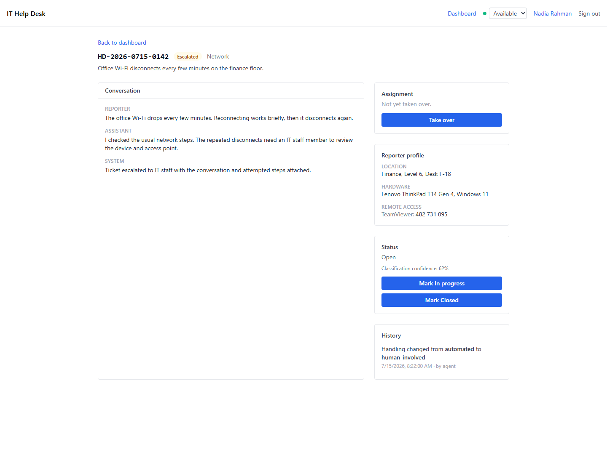
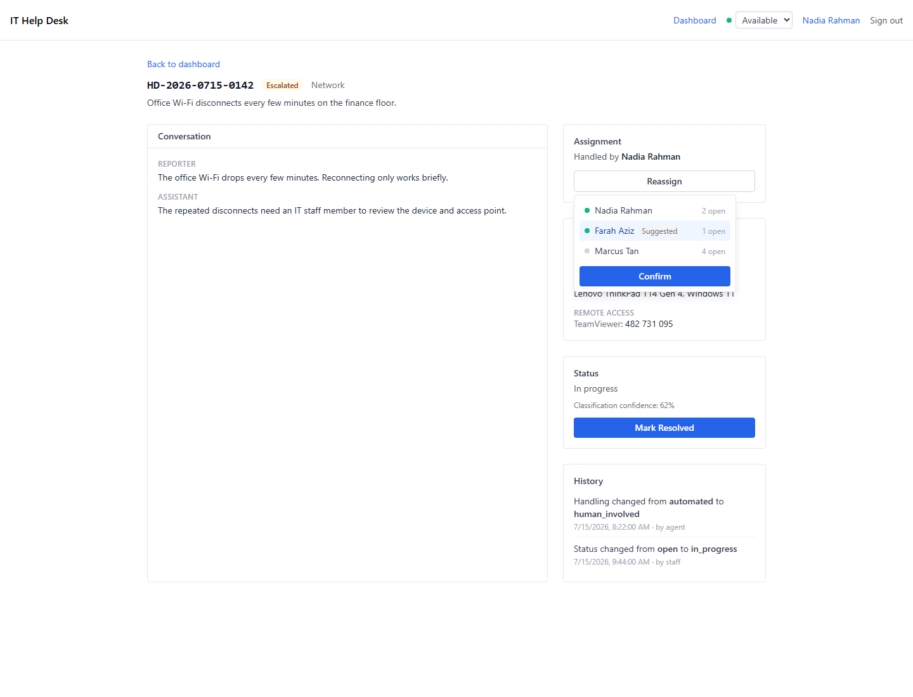

# Staff Assignment US2 Implementation Evidence

Feature 004 User Story 2 adds conflict-safe staff takeover, advisory assignment, and
profile surfacing to the ticket detail route.

## Takeover-ready ticket

The unassigned state keeps the full transcript and reporter profile visible beside the
explicit takeover action. Assignment is never automatic.

## Reassignment picker

The assigned state names the current handler. The inline picker exposes staff
availability and workload, preselects the least-loaded available colleague as an
advisory suggestion, and still requires confirmation.

## Verification

The backend takeover and profile suites passed 10 of 10 tests. The focused frontend
assignment suite passed 5 of 5 tests. `TC-US2-01` through `TC-US2-10` are recorded in
[Chapter 5 Test Case Traceability](../testing/tc-tables.md), and the atomic conflict path
is documented in [Sequence Diagrams](../design/sequence-diagrams.md).
