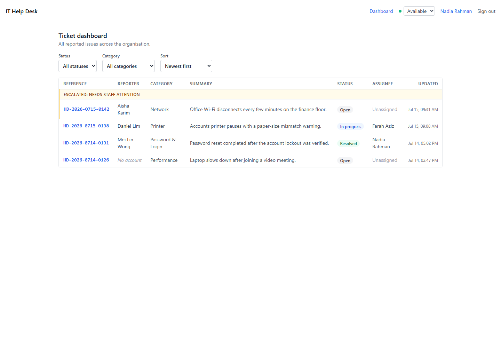

# Staff Dashboard US1 Implementation Evidence

Feature 004 User Story 1 closes the staff support loop: authorised staff can scan all
tickets, prioritise escalations, open the full handover context, and change ticket
status. The captures below use controlled, realistic demonstration records and the real
React routes.

## Dashboard



The dashboard evidence shows the staff-only navigation, availability control,
status/category/sort filters, the distinct escalated group, legacy no-account handling,
status semantics, assignee visibility, and updated timestamps.

## Ticket detail


The detail evidence shows the preserved conversation, classification context, explicit
takeover action, automatically surfaced reporter profile, permitted status actions, and
the handling-mode history.

## Chapter 5 verification

The T016 and T017 suites were run together on 15 July 2026:

```text
npm test -- --run tests/integration/staff-tickets.test.ts tests/integration/staff-events.test.ts

Test Files  2 passed (2)
Tests       10 passed (10)
```

The corresponding `TC-US1-01` through `TC-US1-10` rows are recorded in
[Chapter 5 Test Case Traceability](../testing/tc-tables.md).
